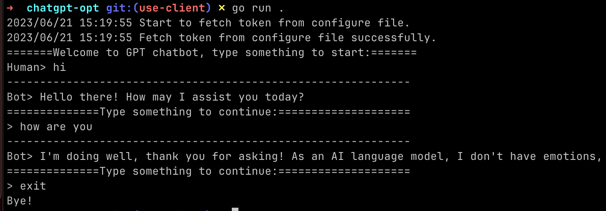

# Go-Chatbot

## Introduction

This is a simple chatbot based on chatgpt, currently we use `gpt-3.5-turbo` model. and we interacts ChatGPT with the API with [Go client library](https://github.com/sashabaranov/go-openai).

## How to use

### Configure the token of OpenAI

Fetch the token from your OpenAI account, and input it into `config.yaml` file like below:

```yaml
chatgpt3: "your token"
```

### Start the chatbot

Currently we need to run go program to interact with the API in this repoisitory directory.

```bash
go run .
```

and a simple demo of this chatbot with chatgpt is shown as below:


