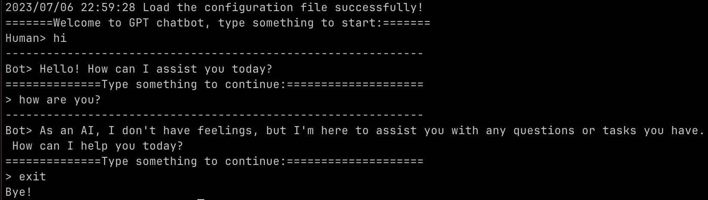

# Go-Chatbot

## Introduction

This is a simple chatbot based on chatgpt, currently we use `gpt-3.5-turbo` model. and we interacts ChatGPT with the API with [Go client library](https://github.com/sashabaranov/go-openai).

## Getting Started

Currently you can get started with this chatbot by building from sources.

### Build

Compiler `Go 1.20+`, checking the [Go Installation](https://golang.org/doc/install) to see how to install Go on your platform.

Use `make` to build and produce the `chatboat` binary file. The executable file will be placed in the `build/bin` directory.

```bash
make
```

### Configure

Create a configuration file (e.g. `$PWD/config.yaml`) using the configuration template file at `resources/config.yaml`.

The following simple configuration example can be used to get started:

```yaml
openai:
  token: "YOUR_API_KEY"
```

You can fetch [API key](https://platform.openai.com/account/api-keys) from your OpenAI account .

### Run

You can run the chatbot by executing the following command:

```bash
./build/bin/chatbot -f config.yaml
```

- `-f` configuration file. It also can be achived by setting the environment variable `CHATBOT_CONFIG`.

## Demo


